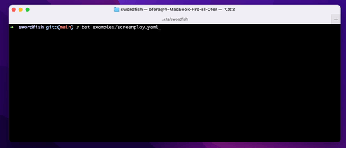

# swordfish-rs

> **Cli tool for typing effect in Terminal for screencasts and demos**

[](https://crates.io/crates/swordfish-rs)
[](https://crates.io/crates/swordfish-rs)

1. 💬 Describe what you are doing
2. ⚡️ Run any terminal command and get their outputs to screen
3. 🤖 Reproducible steps - iterate on the `screenplay` file till perfection
4. 😎 Mimics real person behavior with realtime typing into terminal


## Demo

Example `screenplay.yaml` file:

```yaml
- !clear
- !write {msec: 0, color: green, text:  "$ "}
- !write {msec: 20, text:    "i am going to list this dir"}
- !wait {msec: 1000}
- !erase {msec: 20, by_chars: xxxxxxxxxxxxxxxxxxxxxxxxxxx }
- !wait {msec: 1000}
- !write {msec: 20, text: ls}
- !wait {msec: 1000}
- !execute {line: ls -la}
- !wait {msec: 3000}
- !write {msec: 1000, color: green, text:  "$ "}
- !write {msec: 20, text: "bye, press any key..."}
- !pause
```

Running `swordfish screenplay.yaml`:



## Quick start

Install

```sh
cargo install swordfish-rs
```

## Usage

Create a screenplay file and run swordfish:

```sh
swordfish path/to/file.yaml
```

### Commands

The following commands are available, written with `!` before the command name, for example `!clear`.

#### `write` 

Write text to the terminal.

| Argument | Type | Description |
| - | - | - |
|`text`| String | the text to type in the terminal, each character will be entered one by one with some delay |
|`msec`| Integer | delay between typed chars in millisecs |
|`color` (optional)| String | text's color: `black`, `red`, `green`, `yellow`, `blue`, `magenta`, `cyan`, `white` or a brighter variant, for example `bright_red` |
    
#### `erase` 

Erase characters to the left.

| Argument | Type | Description |
| - | - | - |
|`amount` (optional)| String | the amount of backspaces |
|`by_chars` (optional)| String | the amount of backspace is determined by the length of the provided text |
|`msec`| Integer | delay between individual backspaces in millisecs |

Use either `amount` or `by_chars` or both.

#### `execute` 

Execute shell commands or other applications and show their output.

| Argument | Type | Description |
| - | - | - |
|`line`| String | command line to execute, respects quoted arguments |

The output is presented, while the executed command itself will not show.

#### `wait` 

| Argument | Type | Description |
| - | - | - |
|`msec`| Integer |  delay before next command in millisecs |

#### `clear` 

Clear screen command.

#### `pause` 

Pause before next command and wait for user input (any key...)

#### `prompt`

Prompt specify a constant text that is shown after every `execute` and cis not affected by `erase`.

| Argument | Type | Description |
| - | - | - |
|`text`| String | the prompt text |
|`color` (optional)| String | text's color: `black`, `red`, `green`, `yellow`, `blue`, `magenta`, `cyan`, `white` or a brighter variant, for example `bright_red` |
